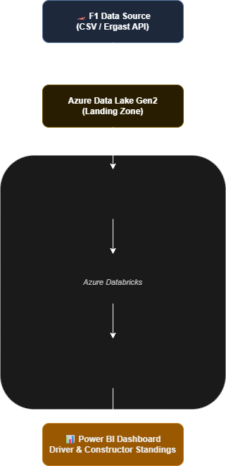

# 🏎️ F1 Racing Analytics — Azure Databricks Pipeline

## 📌 Project Overview
End-to-end data engineering pipeline that processes **Formula 1 race data** using **Azure Databricks** and **medallion architecture (Bronze → Silver → Gold)**, with a Power BI dashboard as the reporting layer.

Built to demonstrate real-world data engineering skills including PySpark transformations, Delta Lake, Unity Catalog, and cloud-based analytics.

---

## 🏗️ Architecture
-------

**Data Flow:**
```
Ergast F1 API / CSV Files
        ↓
Azure Data Lake Storage Gen2 (Landing Zone)
        ↓
Bronze Layer — Raw ingestion (PySpark + Delta Lake)
        ↓
Silver Layer — Cleaned & transformed data (PySpark)
        ↓
Gold Layer — Aggregated views for reporting (SQL Views)
        ↓
Power BI Dashboard
```

---

## 🛠️ Tech Stack

| Tool | Purpose |
|------|---------|
| Azure Databricks | Compute & notebook environment |
| Apache Spark 4.0 (PySpark) | Data ingestion & transformation |
| Delta Lake | ACID transactions & versioning |
| Unity Catalog | Data governance & table management |
| Azure Data Lake Gen2 | Cloud storage |
| Databricks SQL | Gold layer views |
| Power BI | Dashboard & reporting |

---

## 📂 Project Structure

```
Notebooks/
├── 00 - Common/        # Shared utilities & helper functions
├── 01 - setup/         # Environment setup, Unity Catalog config
├── 02 - bronze/        # Raw data ingestion from source files
├── 03 - silver/        # Data cleaning & transformation
├── 04 - gold/          # Aggregated SQL views for reporting
└── 05 - analytics/     # Analysis notebooks
```

---

## 🗄️ Data Layers

### 🥉 Bronze — Raw Ingestion
Ingests raw F1 CSV data into Delta tables using PySpark:
- Circuits, Races, Constructors, Drivers, Results, Sprints

### 🥈 Silver — Transformation
Cleans, casts data types, and standardises schema:
- Circuits, Races, Constructors, Drivers, Results, Sprints

### 🥇 Gold — Reporting Layer
Aggregated SQL views consumed by Power BI:
- `v_driver_standing` — Driver championship standings by season
- `v_constructors_standing` — Constructor championship standings
- `dim_drivers` — Driver dimension table
- `dim_races` — Race dimension table
- `dim_constructors` — Constructor dimension table
- `fact_session_results_df` — Race session results fact table

---

## 📊 Power BI Dashboard
> 🔗 [View Live Dashboard](#) ← *(add your link here after publishing)*

Key metrics tracked:
- Driver standings by season
- Constructor performance trends
- Race results by circuit
- Sprint race analysis

---

## ⚙️ Cluster Configuration
- **Runtime:** Databricks 17.3 LTS (Apache Spark 4.0, Scala 2.13)
- **Node:** Standard_L4as_v4 (32 GB Memory, 4 Cores)
- **Data Access:** Unity Catalog
- **Region:** Central India

---

## 👤 Author
**Karan Bhoyar**
[LinkedIn](#) | [Tableau Portfolio](https://public.tableau.com/app/profile/karan.bhoyar/vizzes)
